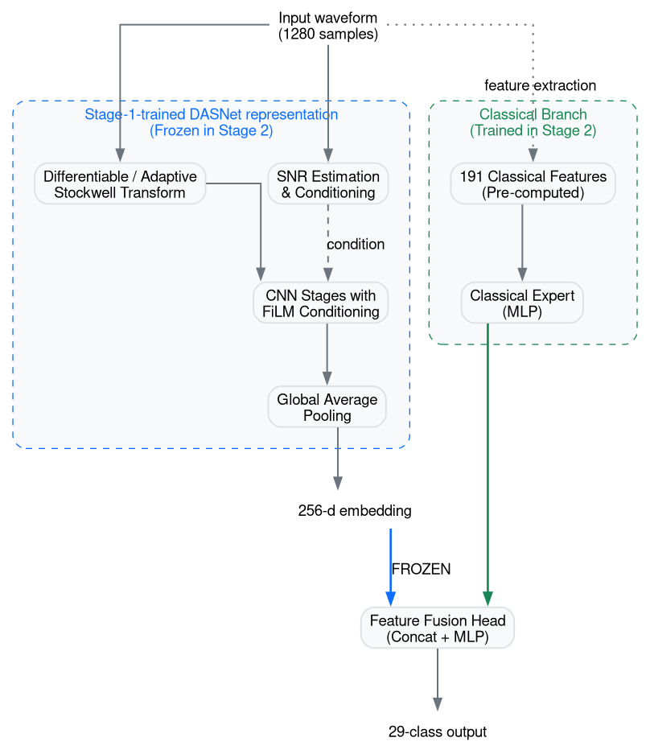

# Frozen-DASNet DualPQ
### Decoupled Hybrid Power Quality Disturbance Classification Across Noise Levels

> The earlier subtitle read "Under Severe Noise". The measured advantage of the
> proposed method is confined to the clean/40 dB/30 dB regime and is not
> statistically distinguishable from the classical ensemble at 20, 10 or 0 dB
> (§8, §9). The framing has been corrected to match the evidence.

## 1. Project Overview
This repository contains the code and evaluation framework for classifying 29 distinct Power Quality Disturbance (PQD) classes under extreme noise conditions. The benchmark evaluates deep, classical, and hybrid architectures using a rigorous waveform-grouped protocol across five independent training seeds.

## 2. Research Question / Motivation
Does fusing a learned time-frequency representation with handcrafted
signal-processing features improve 29-class PQD classification over either
alone, and on which disturbances? Secondarily: does decoupling the two
branches — training the deep representation first and freezing it — avoid the
optimization instability seen when the two are trained jointly?

The noise sweep (clean to 0 dB) is the stress axis of the benchmark, not a
claim of superior low-SNR robustness: at 10 dB and 0 dB no method evaluated
here is usefully better than the classical ensemble (§9).

## 3. Contributions
1. A project-developed PQD classification architecture using a differentiable/adaptive Stockwell-transform-based representation with SNR-conditioned deep processing.
2. A hybrid architecture combining learned deep representations with handcrafted classical signal features.
3. A two-stage frozen-representation training strategy that substantially reduces run-to-run variability relative to the original jointly trained DualPQ configuration.
4. A grouped evaluation protocol covering 29 PQD classes and six noise conditions while keeping all variants of a base waveform within one partition.
5. A five-seed evaluation with preserved raw predictions enabling independent
   verification of reported metrics. Prediction arrays for the Classical
   Ensemble, DASNet and MGCNN-SDTransformer are committed under
   `results/preds/`; those for Frozen-DASNet DualPQ and Original DualPQ-D are
   **not yet committed** and are required for this contribution to hold for
   the proposed method (see §11.8).
6. Per-class × per-SNR accuracy, precision, recall, F1 and Cohen's kappa for
   every model (`results/per_class_snr/`, `results/ALL_MODELS_PER_SNR.md`),
   and reproducible significance testing (`scripts/stats_tests.py`).

## 4. Final Proposed Method
**Frozen-DASNet DualPQ** is our final proposed fusion strategy. It combines a stage-1-trained, frozen DASNet representation with a trainable physical-feature branch and classification head. The study evaluates whether decoupling the stage-1-trained deep representation from end-to-end joint optimization improves robustness and stability. Stage 1 and stage 2 use the same training partition, with validation-based model selection.



## 5. Model Provenance

| Model | Category | Role |
|---|---|---|
| **Classical Ensemble** | Baseline | Classical signal-processing/ML reference |
| **DASNet** | Proposed architecture | Evaluate the project-developed deep representation independently |
| **Original DualPQ-D** | Proposed variant | Original jointly trained hybrid |
| **Frozen-DASNet DualPQ** | Final proposed method | Stage-1-trained DASNet representation frozen during Stage 2 and fused with classical features |
| **MGCNN-SDTransformer** | External/reimplemented baseline | Comparison against a published architecture under our evaluation protocol |

## 6. Experimental Protocol

| Property | Value |
|---|---|
| Classes | 29 |
| Waveform length | 1280 |
| Sampling rate | 6400 Hz |
| Fundamental frequency | 50 Hz |
| Cycles | 10 |
| Evaluation conditions | Clean, 40, 30, 20, 10, 0 dB |
| Dataset size | 34,800 |
| Split | Grouped stratified 70/15/15 |
| Primary metric | Macro-F1 |
| Deep/hybrid training seeds | 5 |
| Reported variability | Mean ± sample SD (ddof=1) |

## 7. Final Results

Mean ± sample SD (ddof=1) over 5 seeds; 95% CI is Student-t with 4 df.
All figures reproducible with `python scripts/stats_tests.py`.

| Model | Mean Macro-F1 | SD | 95% CI |
|---|---:|---:|---:|
| Classical Ensemble (validation-selected) | 71.52 | 0.84 | ± 1.04 |
| Classical Ensemble (`geometric_vote`, fixed) | 72.02 | 0.27 | ± 0.34 |
| DASNet | 69.72 | 9.11 | ± 11.31 |
| MGCNN-SDTransformer † | 66.59 | 0.98 | ± 1.22 |
| Original DualPQ-D | 61.63 | 15.58 | ± 19.35 |
| **Frozen-DASNet DualPQ** | **74.46** | **1.08** | **± 1.34** |

> **Baseline capacity.** All five `baseline_seed*.json` runs were produced with
> `--fast` (RF 300→150 trees, LightGBM 250→120 iterations, MLP 400→120
> iterations), whereas every proposed-method run used its full configuration.
> The single full-capacity classical run available
> (`results/results.json`, seed 0) reaches 72.12 against the reduced-capacity
> seed-0 value of 70.46. The `--fast` penalty on `geometric_vote` — the
> strongest classical variant — is only 0.02 pp, which is why
> `geometric_vote` is quoted above as the fair reference.
>
> **Ensemble selection.** The "validation-selected" row applies the per-seed
> validation rule, which chose `stacked` (the weakest variant) on 2 of 5
> seeds. That depresses the baseline by roughly half a point relative to
> holding the ensemble fixed.
>
> † **MGCNN-SDTransformer seeds 1–4 used `split_seed == seed`** while every
> other model used `split_seed = 0`. Its spread therefore mixes partition
> variance with training variance, and its row is not paired with the others.
> No paired test in this repository includes it. Rerunning those four seeds at
> `--split-seed 0` is outstanding work.

### Training-Strategy Comparison
*Original DualPQ-D* (61.63 ± 15.58) vs. *Frozen-DASNet DualPQ* (74.46 ± 1.08).

The two configurations differ in **three** respects, not one: the deep branch
is frozen; waveform AWGN augmentation is on for the joint run and off for
stage 2; and mixed precision is on for the joint run and explicitly disabled
for stage 2. The effect of freezing is therefore **not identified** by this
comparison alone. In addition, `DualWaveDataset` re-noises the waveform while
leaving the classical feature vector at its original SNR, so the joint run is
trained on mismatched (waveform, feature) pairs that never occur at test time
— a plausible sufficient cause of the seed-3 collapse on its own. An
ablation with `--no-aug` and AMP disabled is required before attributing the
gap to decoupling.

## 8. Per-SNR Results

| Condition | Classical Ensemble | DASNet | MGCNN-SDTr. † | Original DualPQ-D | **Frozen-DASNet DualPQ** | Frozen − Classical | paired *p* |
|---|---:|---:|---:|---:|---:|---:|---:|
| Clean | 87.21 ± 0.44 | 84.79 ± 14.38 | 81.62 ± 1.57 | 77.44 | **91.18 ± 1.42** | **+3.97** | **0.0020** |
| 40 dB | 86.83 ± 0.38 | 90.16 ± 3.30 | 81.58 ± 1.38 | 78.51 | **91.69 ± 1.05** | **+4.86** | **0.0003** |
| 30 dB | 85.74 ± 0.61 | 87.18 ± 5.13 | 80.79 ± 0.99 | 77.16 | **89.56 ± 0.93** | **+3.82** | **0.0002** |
| 20 dB | 80.73 ± 1.59 | 75.85 ± 12.32 | 76.16 ± 0.99 | 67.01 | **82.36 ± 0.95** | +1.63 | 0.112 |
| 10 dB | 62.40 ± 1.74 | 51.70 ± 19.48 | 55.87 ± 0.68 | 35.68 | 62.36 ± 1.45 | −0.04 | 0.928 |
| 0 dB  | 25.75 ± 1.22 | 20.70 ± 9.95 | 22.45 ± 0.87 | 12.79 | **27.00 ± 2.71** | +1.25 | 0.409 |

*p* from a paired t-test over the 5 seeds (`scripts/stats_tests.py`).
Per-class × per-SNR accuracy, precision, recall, F1 and Cohen's kappa for
every model are in `results/per_class_snr/` and
`results/ALL_MODELS_PER_SNR.md`; see `docs/PER_CLASS_SNR_EVALUATION.md`.

**Support caveat.** The test partition holds 30 rows per class per noise
level. One misclassification moves a per-class cell by 3.33 pp and the
binomial standard error at *p* ≈ 0.5 is roughly ±9 pp, so individual cells in
the per-class heatmaps are not significant to the printed precision. Row and
column aggregates and the five-seed means are the trustworthy readings.

## 9. Key Findings

- **Frozen-DASNet DualPQ has the highest mean Macro-F1 among the evaluated
  methods**: 74.46 ± 1.08 against 72.02 ± 0.27 for the strongest classical
  ensemble variant. The margin is **+2.44 pp (95% CI 1.06–3.81, paired
  *t*(4) = 4.93, *p* = 0.008)**. Against the per-seed validation-selected
  classical ensemble the margin is +2.94 pp (CI 1.84–4.04, *p* = 0.002); the
  smaller figure is the one to quote, because it compares against the
  baseline's best fixed configuration.

- **The advantage is concentrated at high SNR, not under severe noise.** It is
  significant at clean, 40 dB and 30 dB (+3.8 to +4.9 pp, *p* ≤ 0.002) and
  indistinguishable from zero at 20 dB (*p* = 0.112), 10 dB (*p* = 0.928) and
  0 dB (*p* = 0.409). At 0 dB, 10 of 29 classes fall below 0.20 F1 for the
  proposed method and 11 of 29 for the classical ensemble; only class 4
  (Interruption) remains usable.

- **The per-class pattern is the substantive result.** Every gain is in the
  compound Sag/Swell + Harmonics + Flicker + Oscillatory-Transient family —
  the hardest classes — while the losses are all on classes the classical
  ensemble already handles well:

  | Gains (pooled F1, pp) | | Losses | |
  |---|---:|---|---:|
  | 22. Sag + Harm + OT | +14.8 | 11. Flicker + Sag | −5.1 |
  | 28. Sag + Harm + Flicker + OT | +11.5 | 17. Notch | −3.3 |
  | 20. Sag + Harm + Flicker | +10.8 | 5. Impulsive transient | −2.9 |
  | 29. Swell + Harm + Flicker + OT | +9.9 | 12. Flicker + Swell | −2.0 |
  | 15. Sag + Harmonics | +6.3 | 1. Pure sinusoidal | −1.3 |

  Frozen-DASNet is worse on 7 of 29 classes; mean delta +2.76 pp. The frozen
  deep representation adds discriminative power where handcrafted features
  saturate, at a small cost on the simple classes.

- **Class 1 (Pure sinusoidal) — the no-disturbance class — is weak for every
  model**: F1 falls to 0.50 at 20 dB and 0.25 at 10 dB for Frozen-DASNet
  DualPQ, 0.48 / 0.32 for the classical ensemble. This is a false-alarm
  concern for deployment and is not visible in any macro average.

- **Run-to-run variability drops from SD 15.58 to SD 1.08**, but see §7: the
  comparison is confounded, and the formal support is weak. Levene's test —
  the only variance test here that survives non-normality — gives *p* = 0.138.
  Bartlett (*p* = 0.00018) and the F-ratio (*p* = 0.00014) both assume
  normality, which the single collapsed seed-3 run (34.91) violates. Excluding
  seed 3, Original DualPQ-D is 68.31 ± 5.13. The reduction should be reported
  descriptively, not as elimination of instability.

- **Stage-1 quality does not predict the stage-2 outcome.** Across all five
  seeds the correlation between DASNet and Frozen-DASNet macro-F1 is
  *r* = 0.987, but excluding the collapsed seed-0 DASNet run it falls to
  *r* = 0.464 (*p* = 0.54). The apparent coupling is one outlier.

## 10. Reproducibility Quickstart

*(Note: Dataset generation and model training are computationally expensive and require a GPU).*

**1. Environment Setup:**
```bash
python -m venv .venv-dasnet
source .venv-dasnet/bin/activate
pip install -r requirements.txt
```

> **The commands below reproduce the pipeline but not §7 verbatim.** They
> omit `scripts/build_waveforms.py` (required by both deep scripts), omit
> `--split-seed 0` (the deep/hybrid runs pin the partition explicitly), and
> the published Classical Ensemble rows were produced with `--fast`, which is
> not shown. Corrected sequence below.

**2. Dataset Generation (Produces 34,800 rows):**
```bash
for k in 0 1 2 3 4 5; do python scripts/build_dataset.py --step $k --n-base 200; done
python scripts/build_dataset.py --merge
```

**2b. Raw waveforms (required by DASNet, DualPQ and MGCNN):**
```bash
python scripts/build_waveforms.py --n-base 200
```

**3. Classical Ensemble baseline (as published — note `--fast`):**
```bash
for i in 0 1 2 3 4; do
  python scripts/run_baseline_multiseed.py --seed $i --fast \
    --out results/multiseed/baseline_seed${i}.json
done
```

**4. DASNet Stage-1 Training:**
```bash
python scripts/run_dasnet.py --out results/multiseed/dasnet_seed0.json --seed 0 --split-seed 0
```

**5. Frozen-DASNet Stage-2 Training:**
```bash
python scripts/run_frozen_dualpq.py --out results/multiseed/frozen_dualpq_seed0.json --checkpoint-dir results/multiseed --seed 0 --split-seed 0
```

**6. Per-class metrics, heatmaps and significance tests:**
```bash
python scripts/reconstruct_preds.py classical --seed 0 --split-seed 0
for k in 0 1 2 3 4; do python scripts/reconstruct_preds.py dasnet --seed $k --split-seed 0; done
python scripts/eval_per_class_snr.py \
  --model "Classical Ensemble (weighted_vote)=results/preds/classical_weighted_vote_seed*_preds.npz" \
  --model "DASNet=results/preds/dasnet_seed*_preds.npz"
python scripts/stats_tests.py --json results/stats_tests.json
```

**7. Evaluation / Artifacts:**
All final evaluated artifacts and predictions are stored in `results/multiseed/`.
For a full manifest, see `results/FINAL_RESULTS.md`.

## 11. Limitations
1. The dataset is entirely synthetic.
2. Real-world electrical measurement validation is not yet performed.
3. Performance at 0 dB remains low — 10 to 11 of 29 classes below 0.20 F1 for
   every method. There is a floor here, not a margin to improve.
4. Five seeds measure training-run variability on the same grouped split; they
   are not five independent dataset partitions. **Exception:**
   MGCNN-SDTransformer seeds 1–4 used `split_seed == seed`, so that model
   alone was evaluated on five different partitions and its variability is
   not comparable to the others'. Rerunning those seeds at `--split-seed 0`
   is outstanding.
5. Generalization to unseen real-world operating conditions remains future
   work. The one extrapolation measurement in the repository
   (`results/unseen_snr.json`) reports a 0.21 macro-F1 gap at 0 dB for the
   classical ensemble on unseen noise levels, and has not been repeated for
   the proposed method.
6. The frozen-vs-joint comparison changes three variables simultaneously
   (freezing, augmentation, mixed precision) and the joint baseline is trained
   on mismatched (waveform, feature) pairs. The contribution of freezing alone
   is not isolated.
7. **No classical-branch-only ablation exists.** The proposed method is
   `fc(concat(z_deep_frozen, z_classical))`; the contribution of the frozen
   deep branch has not been separated from that of the trainable classical
   MLP. The nearest available point is scikit-learn's `MLPClassifier` on the
   same features (68.15 ± 0.15), which is a different optimiser and
   architecture. Note also that stage-2 validation peaks at epoch 0, 2, 5, 6
   and 15 across the five seeds — seed 1's best model precedes any training.
8. Prediction arrays for Frozen-DASNet DualPQ and Original DualPQ-D are not
   committed, so the per-class metrics in `results/per_class_snr_frozen/`
   cannot currently be re-derived from this repository.
9. Baseline capacity and ensemble selection are disclosed in §7; the
   headline margin against the strongest fixed classical variant is +2.44 pp,
   not +2.94 pp.

## 12. Repository Structure
- `src/`: Core architecture implementations (`dasnet.py`, `dualpq.py`, `pipeline.py`).
- `scripts/`: Training and dataset building scripts.
- `experiments/`: Analytical and evaluation scripts.
- `results/`: Contains finalized evaluations (`FINAL_RESULTS.md`) and historical provenance directories.
- `docs/`: Extensive project documentation and figures. See
  `docs/PER_CLASS_SNR_EVALUATION.md` for the per-class metric definitions and
  `docs/PRE_SUBMISSION_CHECKLIST.md` for what remains before submission.

## 13. Publication
This repository supports our submission on hybrid fusion strategies for power quality disturbance classification. Please see `PUBLICATION_AUDIT.md` for our scientific audit framework.
